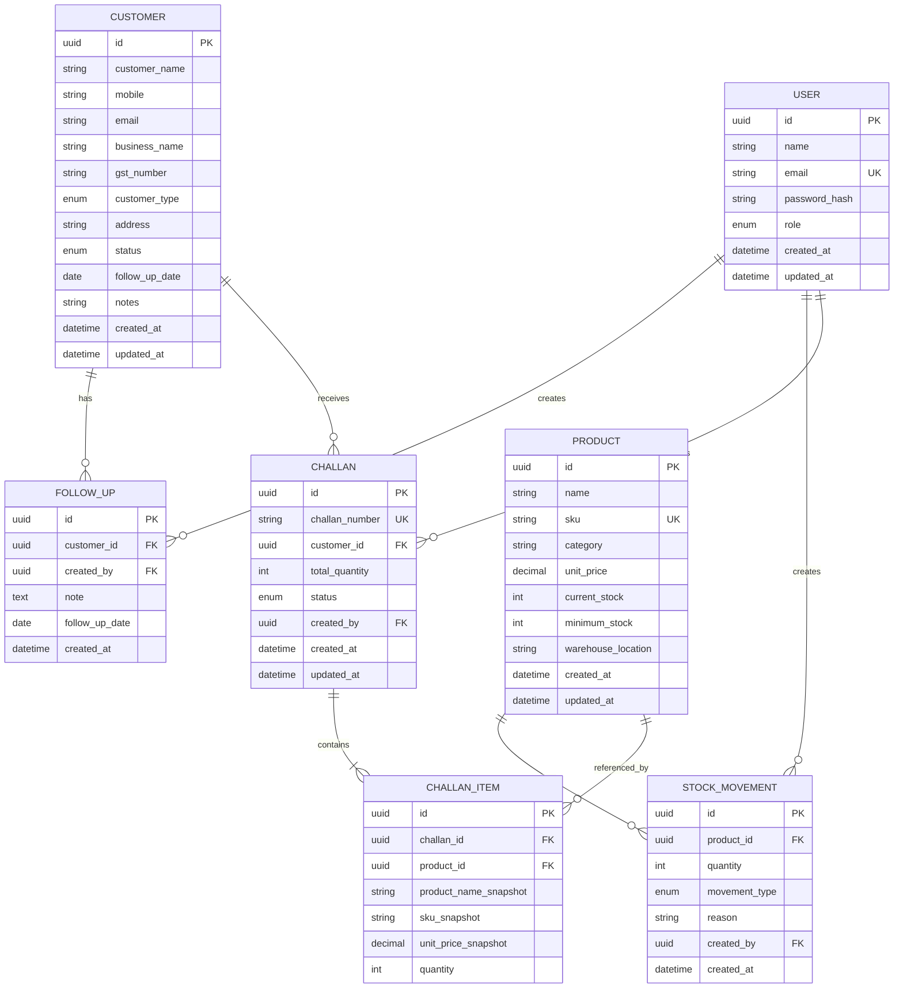

# Database Design

## 1. Database Overview

The application will use PostgreSQL as the relational database.

The database is designed around the main business entities required by the FundsRoom case study:

- Users
- Customers
- Customer Follow-ups
- Products
- Stock Movements
- Sales Challans
- Challan Items

The design maintains relationships between these entities while preserving historical information required for sales challans.

---

## 2. Entity Relationship Diagram



---

## 3. User Table

The `users` table stores application users and their roles.

### Fields

| Field | Type | Description |
|---|---|---|
| id | UUID | Primary key |
| name | VARCHAR | User's name |
| email | VARCHAR | Unique login email |
| password_hash | VARCHAR | Hashed password |
| role | ENUM | ADMIN, SALES, WAREHOUSE, ACCOUNTS |
| created_at | TIMESTAMP | Creation timestamp |
| updated_at | TIMESTAMP | Last update timestamp |

The password will never be stored in plain text.

---

## 4. Customer Table

The `customers` table stores CRM customer information.

### Fields

| Field | Type | Description |
|---|---|---|
| id | UUID | Primary key |
| customer_name | VARCHAR | Customer name |
| mobile | VARCHAR | Mobile number |
| email | VARCHAR | Email address |
| business_name | VARCHAR | Business name |
| gst_number | VARCHAR | Optional GST number |
| customer_type | ENUM | RETAIL, WHOLESALE, DISTRIBUTOR |
| address | TEXT | Customer address |
| status | ENUM | LEAD, ACTIVE, INACTIVE |
| follow_up_date | DATE | Next follow-up date |
| notes | TEXT | Customer notes |
| created_at | TIMESTAMP | Creation timestamp |
| updated_at | TIMESTAMP | Last update timestamp |

---

## 5. Customer Follow-up Table

Follow-ups are stored separately so that a customer can have multiple follow-up records.

### Fields

| Field | Type | Description |
|---|---|---|
| id | UUID | Primary key |
| customer_id | UUID | Related customer |
| created_by | UUID | User who created the follow-up |
| note | TEXT | Follow-up note |
| follow_up_date | DATE | Follow-up date |
| created_at | TIMESTAMP | Creation timestamp |

### Relationship

```text
Customer
   │
   ├── Follow-up
   ├── Follow-up
   ├── Follow-up
   └── Follow-up
```

One customer can have many follow-ups.

---

## 6. Product Table

The `products` table stores product information and current stock.

### Fields

| Field | Type | Description |
|---|---|---|
| id | UUID | Primary key |
| name | VARCHAR | Product name |
| sku | VARCHAR | Unique product SKU |
| category | VARCHAR | Product category |
| unit_price | DECIMAL | Current unit price |
| current_stock | INTEGER | Current available stock |
| minimum_stock | INTEGER | Minimum stock alert quantity |
| warehouse_location | VARCHAR | Warehouse/location |
| created_at | TIMESTAMP | Creation timestamp |
| updated_at | TIMESTAMP | Last update timestamp |

The SKU will be unique.

---

## 7. Stock Movement Table

The `stock_movements` table records changes to product inventory.

### Fields

| Field | Type | Description |
|---|---|---|
| id | UUID | Primary key |
| product_id | UUID | Related product |
| quantity | INTEGER | Quantity changed |
| movement_type | ENUM | IN or OUT |
| reason | VARCHAR | Reason for movement |
| created_by | UUID | User responsible for movement |
| created_at | TIMESTAMP | Movement timestamp |

### Example

```text
Product: Wireless Keyboard
Quantity: 50
Movement: IN
Reason: New purchase
Created by: Warehouse User
```

Later:

```text
Product: Wireless Keyboard
Quantity: 5
Movement: OUT
Reason: Sales Challan CH-0001
Created by: Sales User
```

The movement history provides an audit trail.

---

## 8. Sales Challan Table

The `challans` table stores the main sales challan information.

### Fields

| Field | Type | Description |
|---|---|---|
| id | UUID | Primary key |
| challan_number | VARCHAR | Unique generated challan number |
| customer_id | UUID | Related customer |
| total_quantity | INTEGER | Total quantity across items |
| status | ENUM | DRAFT, CONFIRMED, CANCELLED |
| created_by | UUID | User who created the challan |
| created_at | TIMESTAMP | Creation timestamp |
| updated_at | TIMESTAMP | Last update timestamp |

---

## 9. Challan Item Table

The `challan_items` table stores individual products belonging to a challan.

### Fields

| Field | Type | Description |
|---|---|---|
| id | UUID | Primary key |
| challan_id | UUID | Related challan |
| product_id | UUID | Related product |
| product_name_snapshot | VARCHAR | Product name at challan time |
| sku_snapshot | VARCHAR | SKU at challan time |
| unit_price_snapshot | DECIMAL | Unit price at challan time |
| quantity | INTEGER | Quantity sold |

---

## 10. Product Snapshot Design

The product ID alone is not sufficient for historical challan information.

For example:

```text
Current Product

Name: Wireless Keyboard
SKU: KB-001
Price: ₹1,200
```

A challan is created.

The challan item stores:

```text
Product ID: <product-id>

Product Name Snapshot: Wireless Keyboard
SKU Snapshot: KB-001
Unit Price Snapshot: ₹1,200
Quantity: 5
```

If the product is later changed:

```text
Name: Wireless Mechanical Keyboard
SKU: KB-001
Price: ₹1,500
```

the existing challan will still contain:

```text
Wireless Keyboard
KB-001
₹1,200
5
```

This preserves the historical state of the transaction.

---

## 11. Challan Status

A challan has three possible statuses:

```text
DRAFT
CONFIRMED
CANCELLED
```

### Draft

A draft challan has been created but has not yet affected stock.

### Confirmed

A confirmed challan has successfully passed stock validation and has reduced inventory.

### Cancelled

A cancelled challan cannot be confirmed.

---

## 12. Stock and Challan Transaction

Stock reduction during challan confirmation must be handled as a database transaction.

The logical operation is:

```text
BEGIN TRANSACTION

1. Load challan
2. Verify challan is DRAFT
3. Load all challan items
4. Check stock for every product
5. If any product has insufficient stock:
       Rollback
       Return error

6. Reduce stock for every product
7. Create OUT stock movement for every product
8. Change challan status to CONFIRMED

COMMIT
```

This prevents partial stock updates.

For example, if a challan contains:

```text
Product A → Required: 5 → Available: 20
Product B → Required: 10 → Available: 15
Product C → Required: 8 → Available: 3
```

the entire confirmation must fail.

The system must not reduce Product A and Product B while leaving Product C unchanged.

---

## 13. Data Integrity Rules

The database and backend shall enforce the following rules.

### User

- Email must be unique.
- Password must be stored as a hash.
- Role must be one of the supported roles.

### Customer

- Customer name is required.
- Customer type must be valid.
- Customer status must be valid.
- GST number is optional.

### Product

- Product name is required.
- SKU must be unique.
- Unit price cannot be negative.
- Current stock cannot be negative.
- Minimum stock quantity cannot be negative.

### Stock Movement

- Quantity must be positive.
- Movement type must be either IN or OUT.
- Product must exist.
- Creating user must exist.

### Challan

- Challan number must be unique.
- Customer must exist.
- A challan must contain at least one item.
- Item quantity must be positive.
- Confirmed challans cannot be confirmed again.
- Cancelled challans cannot be confirmed.
- Stock cannot become negative.

---

## 14. Relationships Summary

```text
User
 │
 ├─────────────── creates ────────────────> Challan
 │
 ├─────────────── creates ────────────────> Stock Movement
 │
 └─────────────── creates ────────────────> Follow-up


Customer
 │
 ├─────────────── has ────────────────────> Follow-up
 │
 └─────────────── receives ───────────────> Challan


Product
 │
 ├─────────────── has ────────────────────> Stock Movement
 │
 └─────────────── referenced by ──────────> Challan Item


Challan
 │
 └─────────────── contains ───────────────> Challan Item
```

---

## 15. Indexing Strategy

Indexes will be added to fields commonly used for searching or joining.

Planned indexes include:

- `users.email`
- `customers.mobile`
- `customers.email`
- `customers.business_name`
- `customers.status`
- `customers.customer_type`
- `products.sku`
- `products.category`
- `products.warehouse_location`
- `stock_movements.product_id`
- `stock_movements.created_at`
- `challans.challan_number`
- `challans.customer_id`
- `challans.status`
- `challans.created_at`
- `challan_items.challan_id`
- `challan_items.product_id`

The exact database indexes will be implemented in the Prisma schema.

---

## 16. Database Technology Decision

PostgreSQL was selected because the application contains strongly related business entities and requires transactional operations for inventory updates.

A relational database provides:

- Foreign key relationships
- Transactions
- Constraints
- Structured data
- Reliable consistency for stock operations

The database will be accessed from the Node.js backend.

---

## 17. Database Access

The backend will use Prisma ORM for database access.

The database flow will be:

```text
Express API
     │
     ▼
Service Layer
     │
     ▼
Prisma ORM
     │
     ▼
PostgreSQL
```

Prisma will be responsible for:

- Database queries
- Relationships
- Migrations
- Schema management
- Transactions